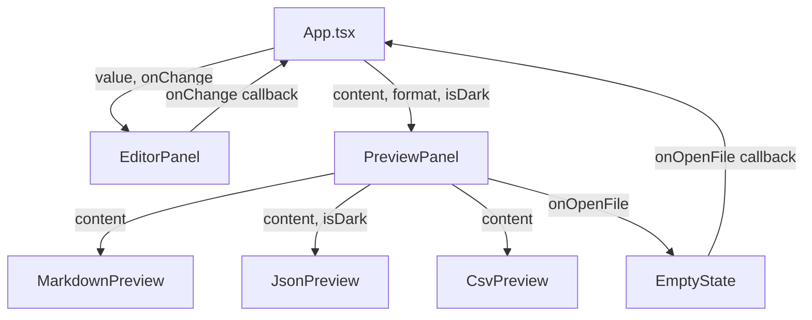
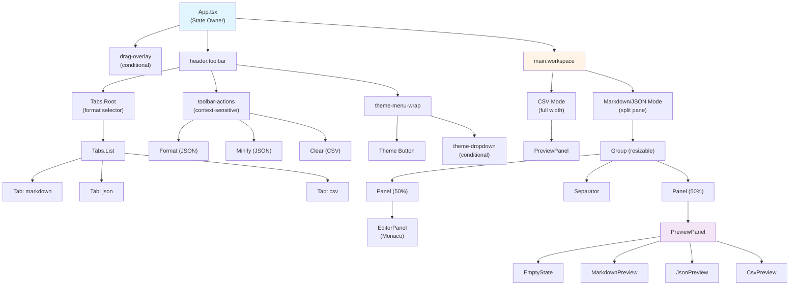

## Component Tree

The entire UI is rendered by `App.tsx`, which conditionally renders child components based on state:

```
App (src/App.tsx)
├── drag-overlay (conditional: isDragOver)
├── header.toolbar
│   ├── Tabs.Root (format selector)
│   │   └── Tabs.List
│   │       ├── Tabs.Tab  value="markdown"
│   │       ├── Tabs.Tab  value="json"
│   │       └── Tabs.Tab  value="csv"
│   ├── toolbar-actions (context-sensitive)
│   │   ├── Button "Format"   (JSON + content only)
│   │   ├── Button "Minify"   (JSON + content only)
│   │   └── Button "Clear"    (CSV + content only)
│   └── theme-menu-wrap
│       ├── Button.toolbar (theme toggle)
│       └── div.theme-dropdown (conditional: themeMenuOpen)
│           └── Button.ghost × 3 (System / Light / Dark)
└── main.workspace
    ├── [CSV mode] PreviewPanel (full width)
    └── [MD/JSON mode] Group (react-resizable-panels)
        ├── Panel (50%)
        │   └── EditorPanel
        │       └── MonacoEditor
        ├── Separator (drag handle)
        └── Panel (50%)
            └── PreviewPanel
                ├── EmptyState          (when content is empty)
                ├── MarkdownPreview     (format === "markdown")
                ├── JsonPreview         (format === "json")
                └── CsvPreview          (format === "csv")
```

## Conditional Rendering

### 1. Drag Overlay

Shown only when a file is being dragged over the window:

```tsx
{isDragOver && <div className="drag-overlay"></div>}
```

The overlay is a fixed-inset blue-tinted layer with centered drop instructions.

### 2. Context-Sensitive Toolbar Actions

Buttons appear between the format tabs and theme menu based on active format + content:

| Condition | Actions Rendered |
|-----------|------------------|
| `format === "json" && content` | **Format** button, **Minify** button |
| `format === "csv" && content` | **Clear data** button |
| All other states | (no actions) |

```tsx
{format === "json" && content && (
  <>
    <Button onClick={formatJson}>Format</Button>
    <Button onClick={minifyJson}>Minify</Button>
  </>
)}
{format === "csv" && content && (
  <Button onClick={clearCsvData}>Clear data</Button>
)}
```

### 3. Theme Dropdown

Shown when `themeMenuOpen === true`:

```tsx
<div className="theme-menu-wrap" ref={themeMenuRef}>
  <Button onClick={() => setThemeMenuOpen((o) => !o)}>
    {THEME_ICONS[themePref]}
    {THEME_LABELS[themePref]}
  </Button>
  {themeMenuOpen && (
    <div className="theme-dropdown">
      {THEME_OPTIONS.map((opt) => (
        <Button
          variant="ghost"
          active={themePref === opt}
          onClick={() => {
            setThemePref(opt);
            setThemeMenuOpen(false);
          }}
        >
          {THEME_ICONS[opt]}
          {THEME_LABELS[opt]}
        </Button>
      ))}
    </div>
  )}
</div>
```

A click-outside handler closes the dropdown when clicking anywhere outside the `themeMenuRef` element.

## CSV Full-Width Mode

When `format === "csv"`, the workspace layout changes dramatically:

<CodeGroup>
```tsx CSV Mode (Full Width)
{format === "csv" ? (
  <PreviewPanel
    content={content}
    format="csv"
    isDark={isDark}
    onOpenFile={openFile}
  />
) : (
  // ... split pane layout
)}
```

```tsx Markdown/JSON Mode (Split Pane)
<Group orientation="horizontal" className="panel-group">
  <Panel defaultSize={50} minSize={20}>
    <EditorPanel
      value={content}
      onChange={handleEditorChange}
      language={FORMAT_LANGUAGE[format]}
      isDark={isDark}
    />
  </Panel>
  <Separator className="resize-handle">
    <div className="resize-handle-bar" />
  </Separator>
  <Panel defaultSize={50} minSize={20}>
    <PreviewPanel
      content={content}
      format={format}
      isDark={isDark}
      onOpenFile={openFile}
    />
  </Panel>
</Group>
```
</CodeGroup>

### Why Full-Width for CSV?

CSV files are read-only in File Viewers. Users interact with the data via search, SQL queries, sorting, and cell selection. The editor would serve no purpose and would waste horizontal space needed for wide tables.

## PreviewPanel Routing

`PreviewPanel` acts as a format router:

```tsx
// PreviewPanel.tsx
export const PreviewPanel = memo(function PreviewPanel({
  content,
  format,
  isDark,
  onOpenFile,
}: PreviewPanelProps) {
  if (!content.trim()) {
    return <EmptyState onOpenFile={onOpenFile} />;
  }

  return (
    <div className="preview-panel">
      {format === "markdown" ? (
        <MarkdownPreview content={content} />
      ) : format === "json" ? (
        <JsonPreview content={content} isDark={isDark} />
      ) : (
        <CsvPreview content={content} />
      )}
    </div>
  );
});
```

### Routing Logic

1. **Empty content** → `EmptyState` (welcome screen with Open File action)
2. **`format === "markdown"`** → `MarkdownPreview`
3. **`format === "json"`** → `JsonPreview`
4. **`format === "csv"`** → `CsvPreview`

## Parent-Child Data Flow

All components follow the controlled component pattern:



### Key Principles

1. **App owns all state** - `format`, `content`, `themePref`, `systemDark`, `themeMenuOpen`, `isDragOver`
2. **Children are pure** - No internal state for core data (exceptions: CSV search/SQL inputs for performance)
3. **Props down, callbacks up** - Data flows down, user actions bubble up via callbacks

## Mermaid Diagram: Component Tree



## UI Primitives Layer

All interactive elements are built with components from `src/components/ui/`:

| Primitive | Wraps | Used In |
|-----------|-------|----------|
| `Button` | `@base-ui/react` Button | Toolbar actions, theme menu, EmptyState |
| `Input` | `@base-ui/react` Input | CSV search, SQL condition input |
| `Textarea` | Native `<textarea>` | (Future: inline editing) |

These primitives enforce consistent styling via Tailwind utility classes and `class-variance-authority` variants.

## Next Steps

<CardGroup cols={2}>
  <Card title="State Management" icon="database" href="/architecture/state-management">
    Learn how state is structured and updated in App.tsx
  </Card>
  <Card title="File Loading" icon="file-import" href="/architecture/file-loading">
    Understand the file loading callback chain
  </Card>
</CardGroup>