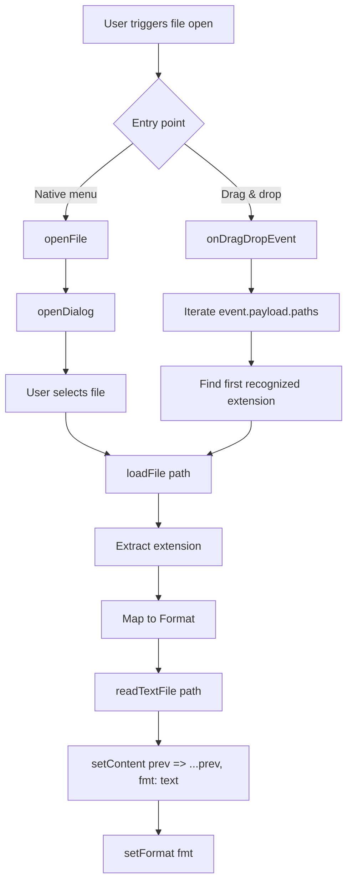
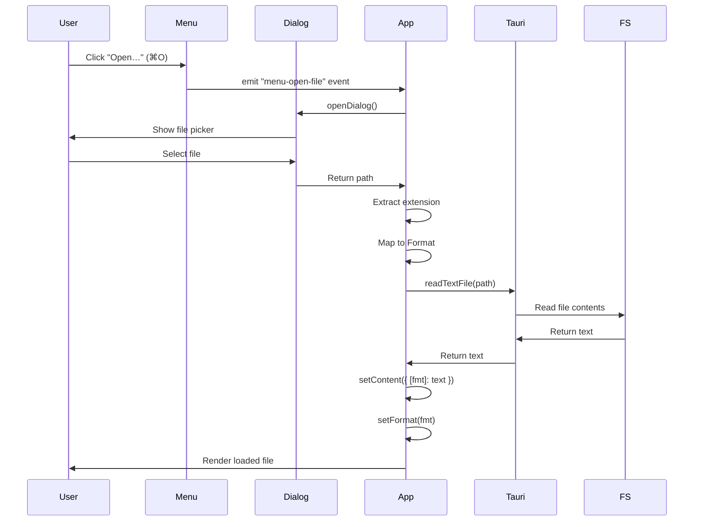

## Overview

File Viewers supports two entry points for loading files:

1. **Native menu** - `File > Open…` (or `⌘O` on macOS)
2. **Drag and drop** - Dragging a file from the OS into the window

Both paths converge on the same `loadFile` function, which reads the file, infers the format, and updates state.

## Callback Chain

The file loading flow follows a clear sequence:



### Code Flow

```tsx
// 1. User clicks "Open File" or presses ⌘O
openFile()
  └─→ openDialog() → path: string
      └─→ loadFile(path)
            ├─ ext  = path.split(".").pop()
            ├─ fmt  = EXT_TO_FORMAT[ext] ?? "markdown"
            ├─ text = await readTextFile(path)
            ├─ setContent(prev => ({ ...prev, [fmt]: text }))
            └─ setFormat(fmt)
```

### Stable Callbacks

Both callbacks are wrapped in `useCallback` to prevent re-creating functions on every render:

```tsx
const loadFile = useCallback(async (path: string) => {
  const ext = path.split(".").pop()?.toLowerCase() ?? "";
  const fmt: Format = EXT_TO_FORMAT[ext] ?? "markdown";
  const text = await readTextFile(path);
  
  setContent((prev) => ({ ...prev, [fmt]: text }));
  setFormat(fmt);
}, []);

const openFile = useCallback(async () => {
  const selected = await openDialog({
    multiple: false,
    filters: [
      {
        name: "Developer Files",
        extensions: ["md", "markdown", "json", "csv"],
      },
    ],
  });
  if (!selected) return;
  await loadFile(selected as string);
}, [loadFile]);
```

## Extension to Format Mapping

The `EXT_TO_FORMAT` constant maps file extensions to internal format types:

```tsx
const EXT_TO_FORMAT: Record<string, Format> = {
  md: "markdown",
  markdown: "markdown",
  json: "json",
  csv: "csv",
};
```

### Supported Extensions

| Extension | Format | Monaco Language | Preview Component |
|-----------|--------|-----------------|-------------------|
| `.md`, `.markdown` | `"markdown"` | `"markdown"` | `MarkdownPreview` |
| `.json` | `"json"` | `"json"` | `JsonPreview` |
| `.csv` | `"csv"` | `"plaintext"` | `CsvPreview` |

### Fallback Behavior

If the extension is not recognized, the format defaults to `"markdown"`:

```tsx
const fmt: Format = EXT_TO_FORMAT[ext] ?? "markdown";
```

## Entry Point 1: Native Menu

The native menu (`File > Open…`) triggers a Tauri event listener:

### Event Listener Setup

```tsx
useEffect(() => {
  let cancelled = false;
  let unlisten: (() => void) | null = null;
  
  listen("menu-open-file", () => openFile()).then((fn) => {
    if (cancelled) fn();
    else unlisten = fn;
  });
  
  return () => {
    cancelled = true;
    unlisten?.();
  };
}, [openFile]);
```

### How It Works

1. The menu item is configured in `src-tauri/src/lib.rs`:
   ```rust
   MenuItem::with_id(app, "open_file", "Open…", true, Some("CmdOrCtrl+O"))?
   ```
2. Clicking the menu item emits a `menu-open-file` event
3. The React listener calls `openFile()`
4. `openDialog()` shows the native file picker
5. The selected path is passed to `loadFile()`

### Cancelled Flag Pattern

The `cancelled` flag prevents race conditions with React StrictMode's double-invocation:

- If the component unmounts before `listen()` resolves, `cancelled` is set to `true`
- The resolved `fn` is immediately called to clean up the listener
- This prevents memory leaks and stale listeners

## Entry Point 2: Drag and Drop

File drag-and-drop uses the Tauri v2 Webview API:

### Webview Event Listener

```tsx
useEffect(() => {
  let cancelled = false;
  let unlisten: (() => void) | null = null;
  
  getCurrentWebview()
    .onDragDropEvent(async (event) => {
      const { type } = event.payload;
      if (type === "enter" || type === "over") {
        setIsDragOver(true);
      } else if (type === "drop") {
        setIsDragOver(false);
        for (const path of event.payload.paths) {
          const ext = path.split(".").pop()?.toLowerCase() ?? "";
          if (EXT_TO_FORMAT[ext]) {
            await loadFile(path);
            break;  // Only load the first recognized file
          }
        }
      } else {
        setIsDragOver(false);  // "leave"
      }
    })
    .then((fn) => {
      if (cancelled) fn();
      else unlisten = fn;
    });
  
  return () => {
    cancelled = true;
    unlisten?.();
  };
}, [loadFile]);
```

### Event Types

| Event Type | Action |
|------------|--------|
| `"enter"` | File enters window → show overlay (`setIsDragOver(true)`) |
| `"over"` | File hovers over window → keep overlay visible |
| `"drop"` | File released → hide overlay, load first recognized file |
| `"leave"` | File leaves window → hide overlay |

### Why Tauri v2 API?

Browser `dragover` and `drop` events **do not fire** for OS-level file drops into a Tauri window. The Tauri Webview API bridges this gap.

### First-File-Only Behavior

If multiple files are dropped, only the **first recognized extension** is loaded:

```tsx
for (const path of event.payload.paths) {
  const ext = path.split(".").pop()?.toLowerCase() ?? "";
  if (EXT_TO_FORMAT[ext]) {
    await loadFile(path);
    break;  // Stop after first match
  }
}
```

## Drag Overlay

When a file is dragged over the window, a visual overlay appears:

```tsx
{isDragOver && (
  <div className="drag-overlay">
    <div className="drag-overlay-card">
      <IconFileDownload size={48} stroke={1.5} />
      <p>Drop file to open</p>
    </div>
  </div>
)}
```

### Styling

- Fixed inset (`position: fixed; inset: 0`)
- Semi-transparent blue tint (`background: rgba(59, 130, 246, 0.1)`)
- Centered card with icon and label
- Pointer events disabled on the overlay itself (`pointer-events: none`)

## File Reading API

File contents are read using Tauri's `readTextFile` API:

```tsx
import { readTextFile } from "@tauri-apps/plugin-fs";

const text = await readTextFile(path);
```

### Required Permissions

Defined in `src-tauri/capabilities/default.json`:

```json
{
  "permissions": [
    "fs:allow-read-text-file",
    "fs:scope-home-recursive"
  ]
}
```

| Permission | Purpose |
|------------|----------|
| `fs:allow-read-text-file` | Allows calling `readTextFile()` |
| `fs:scope-home-recursive` | Grants access to any file under `$HOME` |

## State Updates After Load

After reading the file, two state updates occur:

```tsx
setContent((prev) => ({ ...prev, [fmt]: text }));
setFormat(fmt);
```

### 1. Update Content

Only the format-specific content slot is updated:

```tsx
setContent((prev) => ({
  markdown: prev.markdown,
  json: prev.json,
  csv: prev.csv,
  [fmt]: text,  // Overwrites the slot for the loaded format
}));
```

If a user had Markdown content in the editor and loads a JSON file, the Markdown content is preserved.

### 2. Switch to Loaded Format

The active tab switches to match the loaded file:

```tsx
setFormat(fmt);  // e.g., "json"
```

The UI immediately updates:
- The JSON tab becomes active
- The editor language switches to `"json"`
- The preview panel renders `<JsonPreview />`

## Error Handling

Currently, file loading errors are **not explicitly handled**. If `readTextFile()` throws (e.g., permission denied, file not found), the error propagates and may crash the app.

### Future Improvement

Wrap the `loadFile` call in a try-catch and show an error toast:

```tsx
const loadFile = useCallback(async (path: string) => {
  try {
    const ext = path.split(".").pop()?.toLowerCase() ?? "";
    const fmt: Format = EXT_TO_FORMAT[ext] ?? "markdown";
    const text = await readTextFile(path);
    setContent((prev) => ({ ...prev, [fmt]: text }));
    setFormat(fmt);
  } catch (error) {
    console.error("Failed to load file:", error);
    showErrorToast("Could not open file");
  }
}, []);
```

## Comparison Table: Entry Points

| Entry Point | API | User Action | How `loadFile` is Called |
|-------------|-----|-------------|---------------------------|
| **Native menu** | `@tauri-apps/api/event` → `listen("menu-open-file", …)` | `File > Open…` or `⌘O` | `openFile()` → `openDialog()` → `loadFile(path)` |
| **Drag and drop** | `getCurrentWebview().onDragDropEvent()` | Drag file from OS | Iterates `event.payload.paths`, picks first recognized extension, calls `loadFile(path)` directly |

## Sequence Diagram



## Next Steps

<CardGroup cols={2}>
  <Card title="Component Hierarchy" icon="diagram-project" href="/architecture/component-hierarchy">
    See how loaded content flows through the component tree
  </Card>
  <Card title="State Management" icon="database" href="/architecture/state-management">
    Understand how file content is stored and updated
  </Card>
</CardGroup>